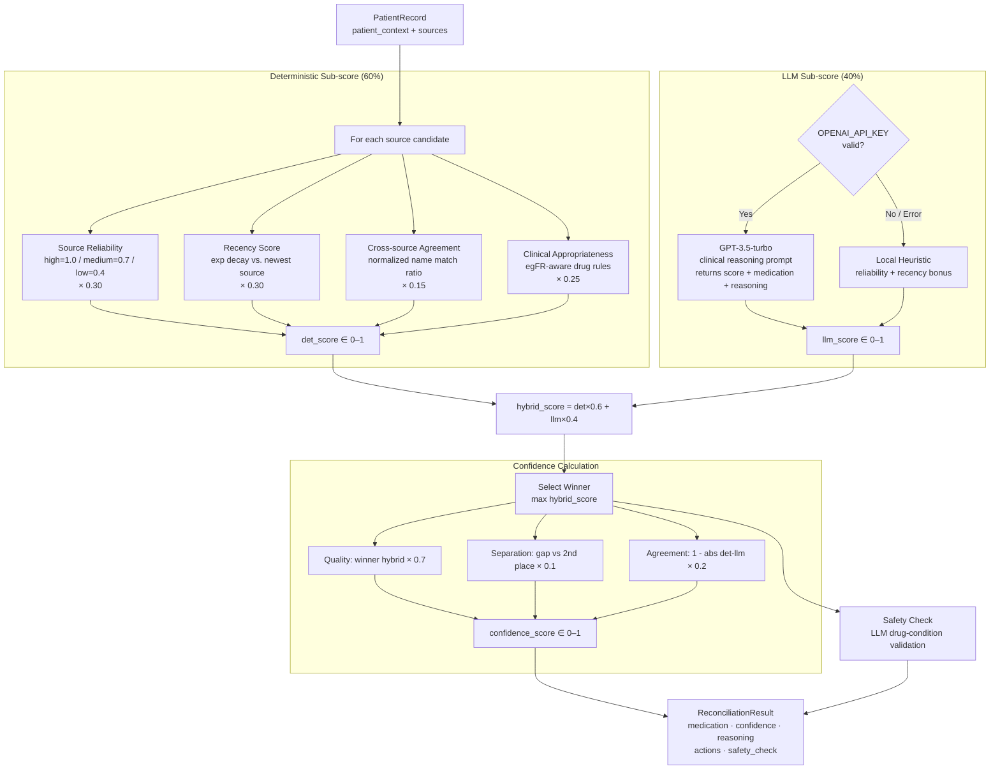

# ADR-0002: Hybrid Deterministic + LLM Scoring Model for Medication Reconciliation

## Context and Problem Statement

The assessment requires a medication reconciliation engine that determines the "most likely truth" across conflicting EHR sources and produces a calibrated confidence score. How should the engine score and rank candidate medication records — using rule-based heuristics alone, an LLM alone, or a combination of both?

## Decision Drivers

* The assessment explicitly awards 25% of points for effective LLM integration, requiring real AI reasoning in the critical path
* Clinical rules (source reliability, recency, drug-condition interactions) are deterministic and auditable — a pure LLM approach would make scoring a black box
* LLM API calls can fail or be absent (no `OPENAI_API_KEY`); the engine must still produce a usable result
* Confidence scores must be calibrated against multiple factors, not just a single model's output
* HIPAA considerations prohibit sending PII to third-party LLMs, limiting what context the LLM can receive

## Considered Options

* **Option A**: Pure LLM scoring — pass all source records to GPT-3.5-turbo and return its chosen medication and confidence score directly
* **Option B**: Pure deterministic scoring — rank sources by reliability, recency, cross-source agreement, and clinical appropriateness rules; no LLM
* **Option C**: Hybrid scoring — compute a deterministic sub-score for each candidate, obtain one LLM score for the best candidate, then combine them in a weighted formula (60% deterministic, 40% LLM)

## Decision Outcome

Chosen option: **Option C — Hybrid scoring (60% deterministic, 40% LLM)**, because it provides auditable, predictable baseline scoring while incorporating LLM clinical reasoning as a meaningful but non-dominant signal. The 60/40 weighting keeps the engine functional and stable when the LLM is unavailable, while the LLM contribution is large enough to influence rankings in ambiguous cases.

### Consequences

* Good, because the engine degrades gracefully: when `OPENAI_API_KEY` is absent or the API call fails, the LLM score is replaced by a local heuristic and the deterministic component still carries 60% of the weight
* Good, because confidence is computed from four independent factors (candidate quality, score separation, det/LLM agreement, uncertainty penalties), making calibration transparent and testable
* Good, because deterministic clinical rules (e.g., metformin dose reduction for eGFR ≤ 45) encode evidence-based medicine that an LLM may under-weight or contradict
* Bad, because the LLM only scores the single "winning" candidate rather than all candidates independently, which can create a scoring asymmetry where non-matching sources are assigned a flat 0.3 penalty
* Bad, because the 60/40 split was set empirically rather than through calibration on a held-out dataset; the optimal ratio is unknown without clinical validation data

### Confirmation

Implementation is confirmed when:
- `MedicationReconciliation.deterministic_score()` produces a 0–1 score per source from reliability + recency + agreement + clinical appropriateness sub-components
- `LLMScorer.score_medication()` returns a score, medication name, reasoning text, and `model_used` field
- `reconcile_medication()` computes `hybrid_score = (det * 0.6) + (llm * 0.4)` for each candidate
- `_calculate_confidence()` derives `overall` from quality (0.7 weight), separation (0.1), and det/LLM agreement (0.2)
- All reconciliation tests pass with and without a valid `OPENAI_API_KEY`

## Pros and Cons of the Options

### Option A: Pure LLM Scoring

Send all source records to GPT-3.5-turbo in a single prompt and accept its answer as the reconciliation result.

* Good, because it offloads complex clinical reasoning to a model trained on medical literature
* Good, because no bespoke rule engineering is required for new drug classes or rare conditions
* Bad, because the engine is completely dependent on API availability — any outage or missing key produces no result
* Bad, because LLM outputs are non-deterministic; the same input can produce different confidence scores across calls (temperature > 0)
* Bad, because there is no mechanism to encode hard clinical rules (e.g., contraindication thresholds based on lab values) that must override model opinion
* Bad, because PII sent to a third-party API increases HIPAA surface area

### Option B: Pure Deterministic Scoring

Rank candidates using only source reliability, recency decay, cross-source agreement, and clinical appropriateness heuristics.

* Good, because scoring is fully reproducible, testable, and auditable without any external API dependency
* Good, because clinical rules can be expressed as explicit, peer-reviewable code
* Good, because no API key, cost, or latency concerns
* Neutral, because recency decay (30-day exponential) and reliability weights (high=1.0, medium=0.7, low=0.4) are reasonable priors but still require domain validation
* Bad, because rules cannot capture nuanced clinical reasoning (e.g., interpreting a recent pharmacy fill in context of a known prescription change)
* Bad, because the assessment explicitly requires LLM integration for full marks

### Option C: Hybrid Scoring — 60% Deterministic + 40% LLM (chosen)

Compute a deterministic sub-score per candidate. Query the LLM once for a recommended medication and its score. Combine: `hybrid = det * 0.6 + llm * 0.4`.

* Good, because the deterministic layer provides a stable, explainable foundation; the LLM adds clinical nuance on top
* Good, because the fallback path (`local-heuristic` or `fallback` model_used values) keeps the service functional with no API key
* Good, because det/LLM agreement is used as one of the four confidence factors, giving the system a self-consistency signal
* Neutral, because the LLM is queried once (for the best candidate selection) rather than per-source, which is a deliberate latency/cost trade-off
* Bad, because non-winning candidates receive a hard-coded 0.3 LLM score, which may unfairly penalize valid alternatives the LLM would have scored higher

## Architecture Diagram

## More Information

- The legacy `reconcile()` / `score_source()` functions in `reconcile_meds.py` use a different 50/50 split and absolute recency decay (90-day half-life vs. newest-source-relative). The `MedicationReconciliation` class (60/40, relative decay) is the active implementation used by the API endpoint.
- PII is intentionally excluded from LLM prompts per HIPAA design constraint (patient name, DOB, MRN are never sent to OpenAI).
- The 60/40 weight split should be revisited once a labeled reconciliation dataset is available for calibration.
- Related: ADR-0001 governs the Flask migration; any async task queue (Celery/Redis) introduced there must preserve the sequential det→LLM→hybrid scoring order within a single reconciliation request.
- If the LLM is unavailable (`model_used` in `{"fallback", "local-heuristic"}`), the LLM score is set equal to the deterministic score to avoid first-source bias rather than defaulting to a neutral 0.5.
