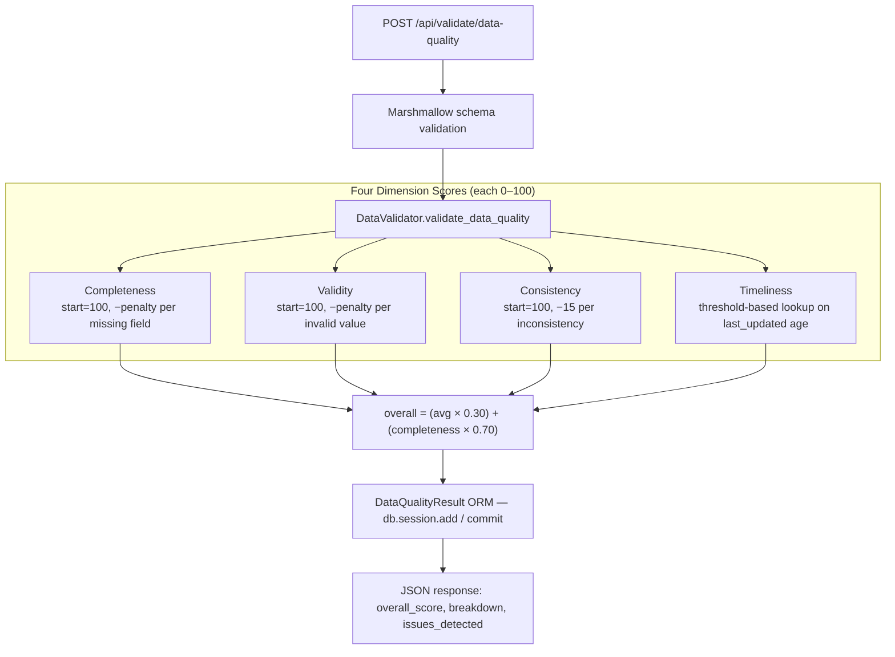
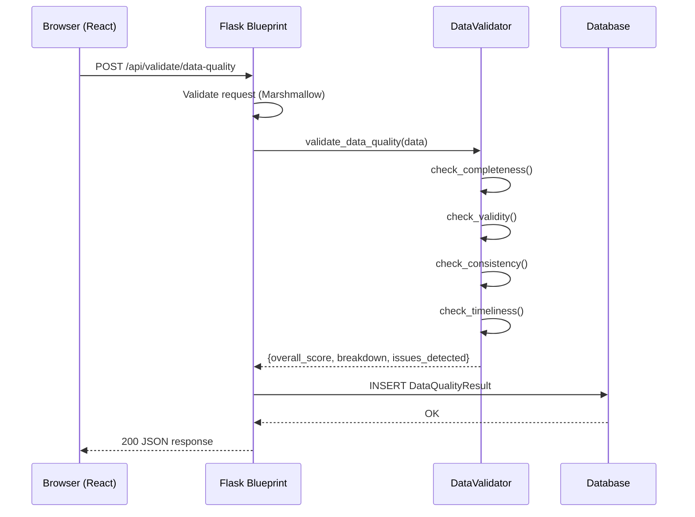

# Design: Data Quality Validation

## Context

The Clinical Data Reconciliation Engine must assess incoming patient data for fitness-for-use before and after medication reconciliation. Clinicians and downstream systems need a transparent, dimension-by-dimension score that identifies specific data gaps so they can be resolved before clinical decisions are made. This design governs the `POST /api/validate/data-quality` endpoint and the `DataValidator` service class.

The endpoint is registered as a Flask blueprint per ADR-0001. Results are persisted to the database per SPEC-0001 REQ "SQLAlchemy ORM Data Layer". No LLM is involved — scoring is entirely rule-based and reproducible.

**Constraints**:
- All scoring is deterministic: same input always produces the same score
- No external API dependencies — the validator must work offline
- HIPAA: patient data is not sent to any external service during validation

---

## Goals / Non-Goals

### Goals
- Score four independent data quality dimensions: completeness, validity, consistency, timeliness
- Return a single calibrated overall score (0–100) that emphasizes completeness (70% weight)
- Identify specific issues with field path, description, and severity
- Persist every result to the database with a UTC timestamp

### Non-Goals
- LLM-based or probabilistic quality assessment
- Cross-record deduplication (comparing multiple patient records for the same person)
- FHIR/HL7 validation (raw JSON input only)
- Suggesting how to fix detected issues (issue description is informational only)

---

## Decisions

### D1: Completeness-Weighted Overall Score

**Choice**: `overall_score = (avg_dimensions × 0.30) + (completeness × 0.70)`

**Rationale**: Completeness is the most operationally critical dimension for a clinical data engine — a record missing demographics or allergies is unsafe to act on regardless of how internally consistent or recent it is. The 70% weight on completeness ensures that missing fields are the dominant signal in the overall score, matching clinical data governance priorities.

**Alternatives considered**:
- **Simple average of four dimensions**: Treats all dimensions equally. Rejected because a record with complete but stale data (timeliness=20) would unfairly score lower than one with recent but incomplete data.
- **Custom weighted average across all four**: More flexible, but adds a fifth configuration surface. The completeness-override formula is simpler to reason about and audit.

---

### D2: Penalty-Based Scoring Within Each Dimension

**Choice**: Each dimension starts at 100 and subtracts a fixed penalty per detected issue.

**Rationale**: Additive scoring (start at 0, add points for present fields) makes it harder to reason about "how far off" a record is. Subtractive scoring makes the impact of each missing or invalid field immediately legible: a missing allergy list costs exactly 15 points.

**Alternatives considered**:
- **Percentage-based**: Score = (present fields / total fields) × 100. Simpler but treats all fields as equally important, which obscures clinically significant gaps.

---

### D3: Severity as a String Enum

**Choice**: Issue severity is serialized as a plain string (`"high"`, `"medium"`, `"low"`) in the API response.

**Rationale**: The `Severity` Pydantic enum used in the service layer serializes as `"Severity.high"` in JSON by default. The API response MUST use plain string values for frontend compatibility. The route handler extracts `.value` from Pydantic enum instances before serialization.

---

## Architecture

### Component Responsibilities

| Component | File | Responsibility |
|-----------|------|----------------|
| Flask blueprint | `backend/api/validation.py` | Request validation (Marshmallow), ORM persistence, response serialization |
| `DataValidator` | `backend/validation_service/data_validator.py` | Four-dimension scoring, issue detection, status classification |
| Marshmallow schemas | `backend/schemas.py` | `DataQualityInputSchema`, `DataQualityOutputSchema` for API validation and OpenAPI docs |
| ORM model | `backend/models/reconciliation.py` | `DataQualityResult` — persists scores and issues with UTC timestamp |
| Pydantic models | `backend/pydantic_models.py` | `Issue`, `Severity` — used internally by `DataValidator` |

### Scoring Pipeline

### Request Lifecycle

---

## Risks / Trade-offs

- **Static penalty values** — Completeness penalties (e.g., missing allergies = −15) are hard-coded. Clinical data governance teams may disagree on the exact weights. Mitigation: expose penalty configuration in `config.py` when the weighting is validated by a clinical informatics review.
- **Consistency rules are narrow** — Only two consistency checks are implemented (negative age, diabetes medication alignment). Real clinical data has many more plausible inconsistencies. Mitigation: the rule set can be extended without changing the scoring architecture; each new rule adds to the issue list and applies the 15-point penalty.
- **No inter-record consistency** — The validator scores a single patient snapshot; it cannot detect inconsistencies across multiple visits or sources. Mitigation: out of scope for current phase; a future spec should address longitudinal consistency.
- **Timeliness thresholds are arbitrary** — The 30/90/365-day thresholds are reasonable defaults but are not calibrated to any specific clinical workflow. Mitigation: make thresholds configurable per deployment.

---

## Open Questions

- Should penalty values be configurable per deployment (e.g., a paediatric context may weight DOB more heavily)?
- Should `data_quality_status` ("EXCELLENT", "GOOD", etc.) be part of the API response, or is `overall_score` sufficient?
- Should the consistency check for diabetes medications be extended to other common condition-medication pairs (hypertension → ACE inhibitor, atrial fibrillation → anticoagulant)?
