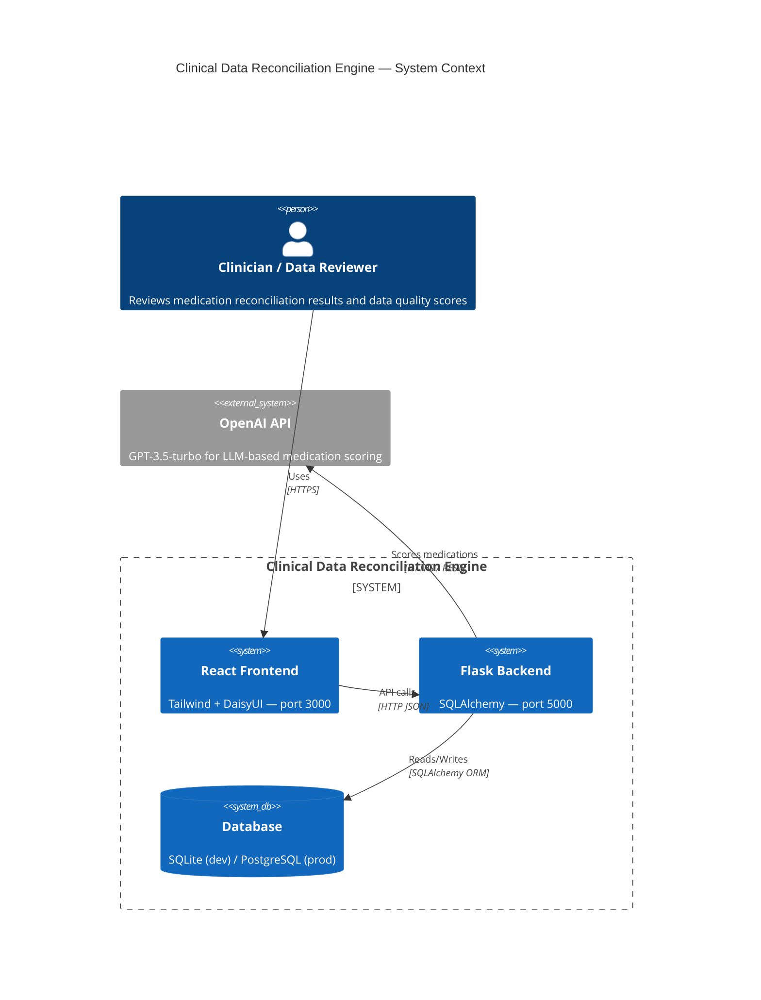
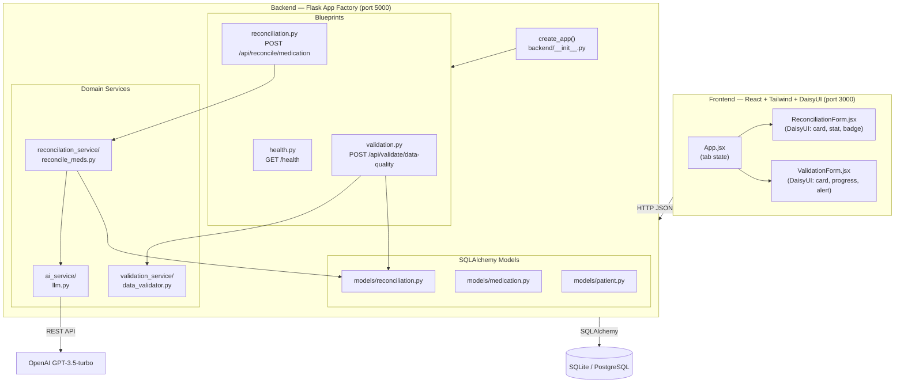
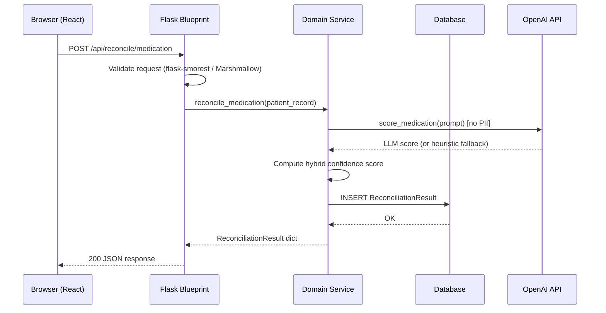

# Design: Flask + SQLAlchemy + React + Tailwind + DaisyUI Project Structure

## Context

The Clinical Data Reconciliation Engine (CDRE) was initially scaffolded with FastAPI (backend) and plain React with hand-written CSS (frontend). As the project requires persistent storage for reconciliation history, audit trails, and patient records — and a consistent, accessible component library for its healthcare UI — a structured migration is needed. This design document describes the architectural decisions for [SPEC-0001](./spec.md), grounded in [ADR-0001](../../../adrs/ADR-0001-flask-sqlalchemy-react-tailwind-daisyui-project-structure.md).

**Constraints**:
- HIPAA considerations: PII must not appear in LLM prompts; audit trails must be maintained
- Existing test suite (`tests/test_api.py`, `tests/test_llm.py`) must continue to pass
- OpenAI API key is optional; LLM scoring falls back to heuristics when absent

---

## Goals / Non-Goals

### Goals
- Establish a Flask application factory with blueprint-based routing
- Introduce SQLAlchemy ORM models and Alembic migration management
- Replace FastAPI route handlers with Flask equivalents at identical URL paths
- Add Tailwind CSS + DaisyUI to the React frontend, replacing hand-written CSS
- Define a canonical directory layout that is enforced going forward

### Non-Goals
- Implementing authentication or authorization (out of scope for this phase)
- Adding new API endpoints or business logic beyond what currently exists
- Replacing React with a server-rendered template engine (rejected in ADR-0001 Option C)
- Containerizing the application with Docker (may be addressed in a future ADR)

---

## Decisions

### Flask Application Factory Pattern

**Choice**: Use `create_app(config_name)` as the single entry point for the Flask app, defined in `backend/__init__.py`.

**Rationale**: The factory pattern enables multiple app instances with different configurations (development, test, production), which is essential for pytest isolation — each test can call `create_app("testing")` with an in-memory SQLite database. It also prevents circular imports by deferring extension initialization.

**Alternatives considered**:
- **Module-level app instance** (`app = Flask(__name__)` at top of `main.py`): Simpler initially, but breaks test isolation and makes configuration switching awkward. Rejected.

---

### Blueprint-per-Domain Routing

**Choice**: Three blueprints registered with URL prefixes: `health` (`/`), `reconciliation` (`/api/reconcile`), `validation` (`/api/validate`).

**Rationale**: Blueprints mirror the existing service module boundaries (`reconcilation_service/`, `validation_service/`, `ai_service/`). This keeps route handlers co-located with their domain and makes it straightforward to add or remove a domain without touching other routes.

**Alternatives considered**:
- **Single routes file**: All routes in one `routes.py`. Works for small apps but becomes unmaintainable as the endpoint count grows. Rejected.

---

### SQLAlchemy ORM with Flask-Migrate

**Choice**: Flask-SQLAlchemy for ORM, Flask-Migrate (Alembic) for schema migrations. Models live under `backend/models/` as one file per domain entity.

**Rationale**: Flask-SQLAlchemy integrates session lifecycle management with Flask's request context, ensuring sessions are scoped per request and automatically cleaned up. Alembic provides version-controlled, reversible schema migrations — critical for a clinical application where schema changes must be auditable.

**Alternatives considered**:
- **Raw SQL / psycopg2**: Maximum control, but no ORM abstraction means more boilerplate for CRUD and no migration tooling. Rejected.
- **SQLModel (Pydantic + SQLAlchemy)**: Attractive for FastAPI parity, but introduces additional dependency and is less mature. Rejected for this migration; may be reconsidered if FastAPI is readopted.

---

### Request Validation with flask-smorest

**Choice**: Use `flask-smorest` for request/response schema validation and automatic OpenAPI 3.x doc generation. Pydantic models from the FastAPI era are converted to Marshmallow schemas.

**Rationale**: `flask-smorest` provides decorator-based schema binding (`@blp.arguments`, `@blp.response`) that is idiomatic in Flask and generates OpenAPI docs at `/docs` with no separate configuration. Marshmallow is the standard Flask validation library with broad community support.

**Alternatives considered**:
- **flask-pydantic**: Allows reusing existing Pydantic models, reducing migration effort. However, it lacks OpenAPI doc generation and has a smaller maintenance community. Rejected.
- **Manual validation**: No schema library; validate in route handler code. Error-prone and produces no docs. Rejected.

---

### Tailwind CSS via PostCSS

**Choice**: Install Tailwind CSS as a PostCSS plugin in the React project. Configure `tailwind.config.js` to scan all `src/**/*.{js,jsx}` files for class purging.

**Rationale**: Create React App (CRA) supports PostCSS natively. Tailwind's JIT compiler keeps build times fast, and purging ensures the production CSS bundle remains small. This approach requires no ejection from CRA.

**Alternatives considered**:
- **Vite + Tailwind**: Faster builds and better HMR, but requires migrating from CRA. Out of scope for this migration. May be adopted in a future ADR.
- **Styled-components**: CSS-in-JS approach. Conflicts with DaisyUI's class-based theming. Rejected.

---

### DaisyUI as Tailwind Plugin

**Choice**: Install DaisyUI as a Tailwind plugin (`plugins: [require("daisyui")]` in `tailwind.config.js`). Use semantic component classes (`badge`, `alert`, `card`, `stat`, `progress`) for clinical data display.

**Rationale**: DaisyUI's semantic classes map directly to clinical UI patterns (status indicators, score breakdowns, alert severity levels). Theme support via `data-theme` attribute enables a consistent visual language without per-component color decisions. DaisyUI ships accessible color combinations validated against WCAG contrast requirements.

**Alternatives considered**:
- **shadcn/ui**: Headless, accessible components — excellent quality, but requires a more complex build setup (Radix UI, class-variance-authority). Overkill for the current scope. Rejected.
- **Material UI**: React-specific component library. Does not compose with Tailwind naturally; would conflict with utility-class approach. Rejected.

---

## Architecture

### System Context

### Container Architecture

### Request Lifecycle Sequence

---

## Risks / Trade-offs

- **Synchronous LLM calls block Flask worker threads** → Mitigate by setting a short timeout on OpenAI API calls and relying on the heuristic fallback; long-term, offload to a task queue (Celery + Redis).
- **SQLite not suitable for concurrent production load** → Default `DATABASE_URL` uses SQLite for development convenience; production deployments MUST set `DATABASE_URL` to a PostgreSQL connection string.
- **CRA is in maintenance mode** → Create React App is no longer actively maintained. This is accepted for the current migration phase; a future ADR should evaluate migration to Vite.
- **flask-smorest Marshmallow schemas duplicate Pydantic model effort** → Keep schema definitions minimal (only fields required for API validation); avoid duplicating business logic already in service layer.
- **DaisyUI WCAG compliance** → DaisyUI provides accessible default themes, but custom theme overrides MUST be checked against WCAG 2.1 AA contrast ratios before shipping clinical-facing UI.

---

## Migration Plan

1. **Backend migration**
   1. Add `flask`, `flask-sqlalchemy`, `flask-migrate`, `flask-cors`, `flask-smorest` to `requirements.txt`; remove `fastapi`, `uvicorn`
   2. Create `backend/__init__.py` with `create_app()`, `backend/config.py`
   3. Define ORM models in `backend/models/`
   4. Run `flask db init && flask db migrate && flask db upgrade`
   5. Rewrite `backend/main.py` routes as Flask blueprints under `backend/api/`
   6. Verify existing test suite passes with `pytest tests/test_api.py -v` (update server URL from 8000 → 5000 in test fixtures)

2. **Frontend migration**
   1. `npm install -D tailwindcss postcss autoprefixer && npx tailwindcss init -p`
   2. `npm install daisyui`
   3. Configure `tailwind.config.js` with DaisyUI plugin and content paths
   4. Add `@tailwind base; @tailwind components; @tailwind utilities;` to `index.css`
   5. Rewrite `ReconciliationForm.js` and `ValidationForm.js` using DaisyUI components; delete `.css` files
   6. Update `package.json` proxy to point to `http://localhost:5000`
   7. Run `npm run build` to verify clean production build

**Rollback**: The FastAPI backend can be restored from git history. The frontend CSS files are tracked in git and can be restored via `git checkout`.

---

## Open Questions

- Should `ReconciliationResult` ORM model store the full LLM prompt/response for audit purposes, or only the final score? (HIPAA review needed)
- Is PostgreSQL the target production database, or will a managed cloud DB (AWS RDS, Supabase) be used?
- Should Flask serve the React `build/` static files in production, or will nginx handle static file serving?
- Is there a need for user authentication (login/session) in this project phase?
