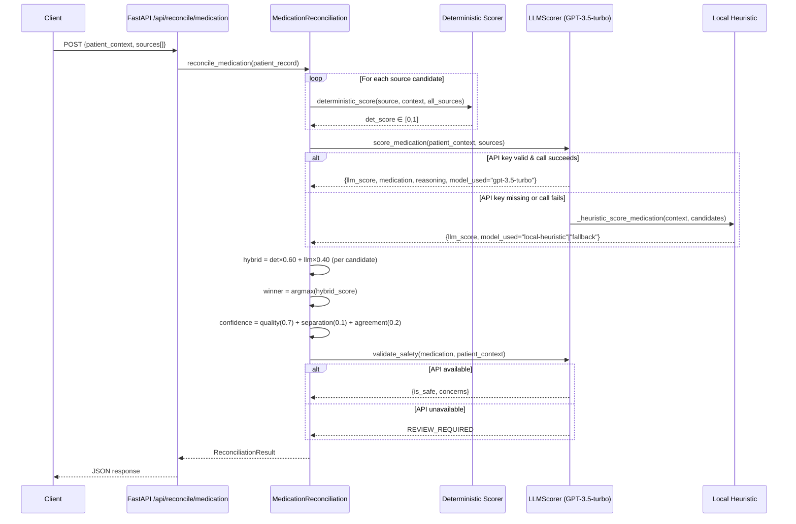
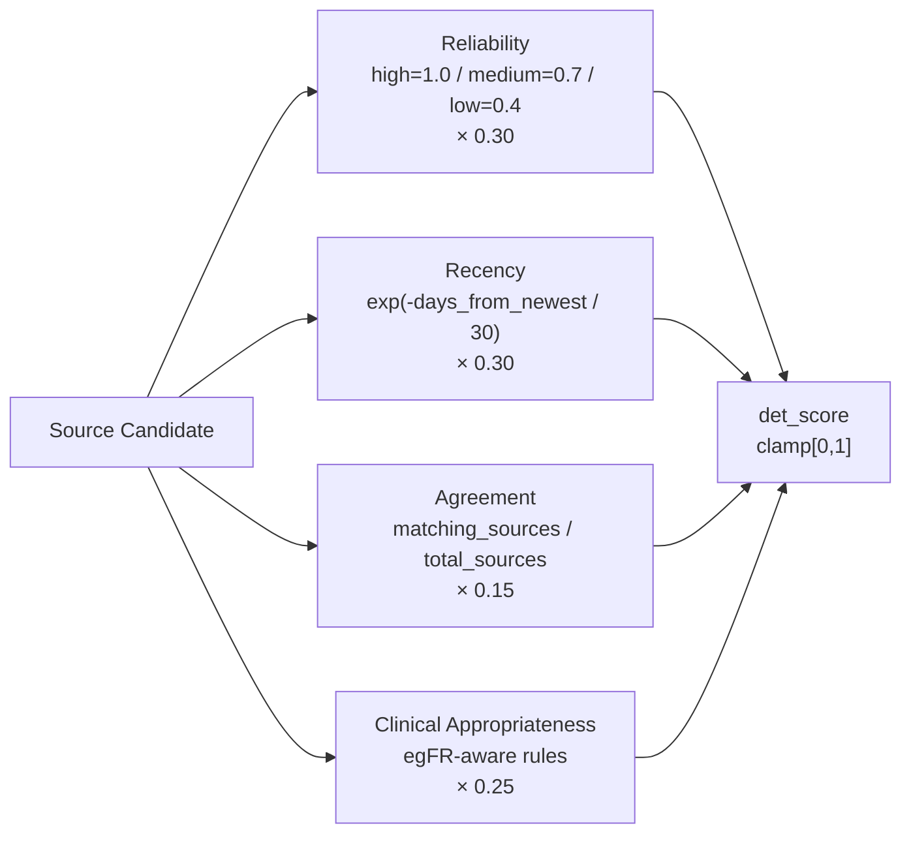

# Design: Medication Reconciliation

## Context

The clinical data reconciliation engine must resolve conflicting medication records from multiple EHR sources (hospital EHRs, primary care, pharmacy, patient portals) and produce a clinically defensible recommendation with a calibrated confidence score. This design governs the `POST /api/reconcile/medication` endpoint and the `MedicationReconciliation` service class.

The engine was built to satisfy the Onye EHR Integration intern take-home assessment, which requires AI integration (35% of marks) alongside sound reconciliation logic (25%). The hybrid scoring model was chosen as documented in [ADR-0002](../../../adrs/ADR-0002-hybrid-deterministic-llm-reconciliation-scoring.md); the API and service layer architecture is governed by [SPEC-0001](../flask-sqlalchemy-react-tailwind-daisyui-project-structure/spec.md) (Flask migration) and [ADR-0001](../../../adrs/ADR-0001-flask-sqlalchemy-react-tailwind-daisyui-project-structure.md).

Constraints:
- HIPAA: PII (name, DOB, MRN) MUST NOT be sent to OpenAI
- The engine must be functional with no `OPENAI_API_KEY` (local fallback required)
- No database persistence is required in the current implementation (in-memory per-request)

---

## Goals / Non-Goals

### Goals
- Produce a ranked medication recommendation across N conflicting source records
- Compute a calibrated, interpretable confidence score (0–1)
- Integrate LLM reasoning while maintaining full fallback functionality
- Return human-readable reasoning and actionable clinical recommendations
- Enforce clinical safety checks (drug-condition interaction) before surfacing a recommendation

### Non-Goals
- Persistent storage of reconciliation history (future ADR-0001 migration scope)
- Real-time webhook push of reconciliation results
- Support for non-medication clinical data reconciliation (separate validation service)
- FHIR/HL7 format parsing (raw JSON input only in current version)

---

## Decisions

### D1: 60/40 Deterministic/LLM Weighting

**Choice**: `hybrid_score = det × 0.60 + llm × 0.40`
**Rationale**: The deterministic layer encodes evidence-based clinical rules that are auditable and reproducible. The LLM layer adds contextual clinical reasoning (e.g., interpreting a pharmacy fill in context of a known prescription change) that deterministic rules cannot capture. The 60/40 split keeps the engine stable and functional when the LLM is unavailable, while giving the LLM enough weight to influence outcomes in ambiguous cases.
**Alternatives considered**:
- **50/50 split** (used in the legacy `score_source()` function): equal weighting gives the LLM too much influence when it falls back to heuristics, potentially introducing bias toward whichever candidate the heuristic selects first.
- **Pure LLM**: complete API dependency; no auditability; non-deterministic outputs.
- **Pure deterministic**: misses nuanced clinical reasoning; does not meet assessment LLM integration requirement.

### D2: Single LLM Call Per Reconciliation Request

**Choice**: Query the LLM once to select a recommended medication and score across all candidates, rather than one call per candidate source.
**Rationale**: Reduces latency and API cost. The LLM receives all candidate sources in a single prompt and returns one recommendation; non-matching candidates receive a penalty score (0.3). This is a deliberate trade-off: per-candidate calls would produce more granular scores but at N× the cost and latency.
**Alternatives considered**:
- **Per-candidate LLM calls**: more accurate individual scores, but O(N) API calls per request; cost-prohibitive at scale.

### D3: LLM Fallback — Set LLM Score = Det Score

**Choice**: When the LLM is unavailable, set each candidate's `llm_score` equal to its `deterministic_score`.
**Rationale**: Setting `llm_score = det_score` makes `hybrid = det × 0.60 + det × 0.40 = det`, preserving pure deterministic ordering with no first-source bias. A neutral 0.5 default would artificially boost low-scoring deterministic candidates.
**Alternatives considered**:
- **0.5 neutral fallback**: distorts rankings when det_score << 0.5 or >> 0.5.
- **Skip hybrid, use det directly**: equivalent outcome but requires conditional branching in the scoring loop.

### D4: PII Exclusion from LLM Prompts

**Choice**: LLM prompts include age, conditions, and recent labs — no name, DOB, or MRN.
**Rationale**: HIPAA compliance. The minimal clinical context (age + conditions + labs) is sufficient for medication appropriateness reasoning without requiring re-identification risk.

### D5: Confidence from Four Independent Factors

**Choice**: `confidence = (winner_hybrid × 0.70) + (gap × 0.50 × 0.10) + ((1 − |det − llm|) × 0.20)`
**Rationale**: A single-factor confidence (e.g., raw score alone) does not capture uncertainty from close competitors or from disagreement between scoring methods. Three factors provide interpretable, independently meaningful contributions: raw quality of the winner, uniqueness of its lead, and internal consistency between the two scoring approaches.

---

## Architecture

### Component Responsibilities

| Component | File | Responsibility |
|-----------|------|----------------|
| API endpoint | `backend/main.py` | Request validation, response serialization |
| `MedicationReconciliation` | `backend/reconcilation_service/reconcile_meds.py` | Orchestrates scoring pipeline; computes hybrid score, confidence, actions |
| `LLMScorer` | `backend/ai_service/llm.py` | OpenAI API calls; local heuristic fallback; safety validation |
| Pydantic models | `backend/models.py` | Input/output contracts: `PatientRecord`, `ReconciliationResult`, `SafetyCheck` |

### Deterministic Sub-score Composition

---

## Risks / Trade-offs

- **LLM scores only the winning candidate** → Non-winning candidates receive a flat 0.3 LLM penalty. This may unfairly penalize a valid alternative that the LLM would have scored highly. Mitigation: confidence separation factor partially compensates; per-candidate calls are the long-term fix.
- **60/40 weights are empirical** → The split was set without a calibration dataset. Mitigation: revisit when labeled reconciliation data is available; add a weight configuration parameter.
- **Metformin/eGFR is the only encoded drug-condition rule** → The clinical appropriateness component returns a neutral 0.75 for all other medications. Mitigation: rule set should expand with clinical input; LLM safety check provides a broader safety net.
- **OpenAI GPT-3.5-turbo used over GPT-4** → Lower cost and latency but potentially weaker clinical reasoning. Mitigation: model is configurable; upgrade path is a one-line change in `llm.py`.
- **No response caching** → Identical requests re-query the LLM. Mitigation: add deterministic cache keyed on `(patient_context_hash, sorted_sources_hash)` to reduce API cost at scale.

---

## Migration Plan

This spec describes the current FastAPI implementation. When ADR-0001's Flask migration is executed:
1. `MedicationReconciliation` service class is framework-agnostic and requires no changes
2. `LLMScorer` is framework-agnostic and requires no changes
3. The `POST /api/reconcile/medication` route handler in `main.py` MUST be rewritten as a Flask Blueprint view function
4. Pydantic request/response models should be retained; use `flask-pydantic` or manual `.model_validate()` for Flask request parsing
5. Async LLM calls must be wrapped in `concurrent.futures.ThreadPoolExecutor` since Flask is synchronous by default

---

## Open Questions

- What is the optimal det/LLM weight split after calibration on real reconciliation data?
- Should non-winning candidates receive individual LLM scores rather than a flat 0.3 penalty?
- Should the safety check run in parallel with scoring or sequentially? (Currently sequential.)
- What is the appropriate response caching strategy — Redis, in-memory LRU, or request-level memoization?
